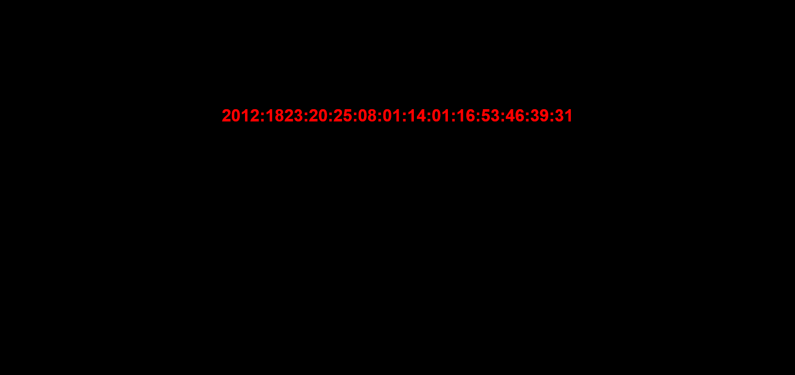
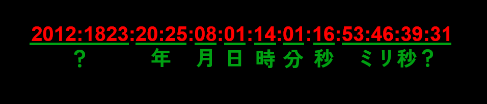
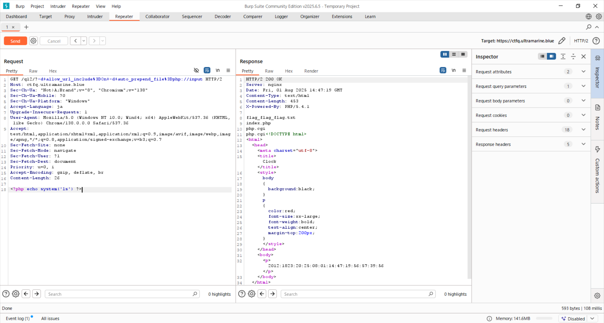

## Hypertext Preprocessor (70pt)
> http://ctfq.u1tramarine.blue/q12/  
> https://ctfq.u1tramarine.blue/q12/

アクセスしてみるとホラーな画面が。


ページ名が"Clock"なので、変な区切り方だがこの数字の並びは現在時刻を表しているのだろう。ただ、リアルタイムに反映しているわけではなく、ページを読み込んだタイミングの時刻を表示しているようだ。  
一瞬読み方に困ったが、ちょっとしてから下の画像のように読めばいいと分かった。タイムゾーンはJSTではなくUTCであることに注意。


とすると、画像でも「？」で示している"2012:1823"は何なのか？そのまま検索に掛けてみると、いかにも今回の問題に関係がありそうな徳丸さんの[記事](https://blog.tokumaru.org/2012/05/php-cgi-remote-scripting-cve-2012-1823.html)がヒットした。この記事の通りにhttps://ctfq.u1tramarine.blue/q12/?-s にアクセスすると、PHPのソースコードをリークさせることができた。内容を以下に示す。
```php
<?php

    //  Flag is in this directory.

    date_default_timezone_set('UTC');
    
    $t = '2012:1823:20:';
    $t .= date('y:m:d:H:i:s');
    for($i=0;$i<4;$i++)
        $t .= sprintf(':%02d',mt_rand(0,59));
?>
```

フラグはこのディレクトリにあるという。メタ読みで`flag.txt`や`flag.html`を試してみたが流石に外れだった。ならば、そのディレクトリ内に格納されているファイルの名前を知る手段が欲しい。  
さて、先ほど挙げた記事によると、CVE-2012-1823は外部からの任意のスクリプト実行も可能だという。そしてPHPにはsystem関数があり、システムコールが行える。
つまり、
```php
<?php echo system('ls') ?>
```
これを実行させれば良さそうである。  
ということで、Burp SuiteのRepeaterで以下のようにリクエストを送ると、ディレクトリの内容をリークさせることができた。


この`flag_flag_flag.txt`にフラグが書いてあった。（アクセス制限等は無し）
