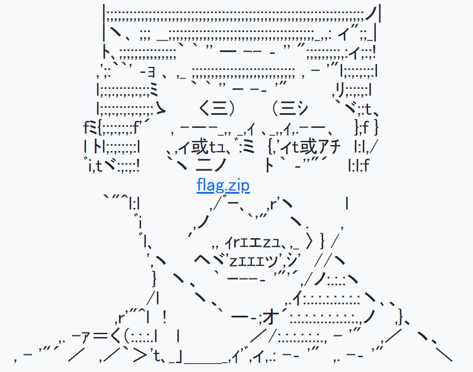

## Zip de kure (150pt)
> What anyone uses is actually secure?
> 
> The ASCII art has no meaning.
>
> 

~~2012年時点でも古そうなネタを~~

与えられている`flag.zip`はパスワードが掛かっており、開くことができない。バイナリに何か手がかりが無いかと見てみると、末尾にこんな文章が残されていた。
```
Hint:
- It is known that the encryption system of ZIP is weak against known-plaintext attacks.
- We employ ZIP format not for compression but for encryption.
```

ZIPフォーマットはknown-plaintext attack、すなわち既知平文攻撃に弱いという。つまり、ZIPアーカイブ内に含まれているファイルに既知のものがあればパスワードを破ることができる。  
引き続きバイナリを読んでいると、`flag.zip`には`flag.html`と`Standard-lock-key.jpg`の2つのファイルが含まれていることが分かった。前者は既知でありようがないため、後者がネットに転がっていないか探すと、Wikimediaコモンズに[あった](https://commons.wikimedia.org/wiki/File:Standard-lock-key.jpg)。これのOriginal fileを持ってきて攻撃を試みる。ツールは[pkcrack](https://github.com/keyunluo/pkcrack)を用いた。  
しかし解析に失敗してしまう。解像度が小さいものを全て試してもダメだった。どうしてだろうと思いコモンズの方をもう一度見てみると、古いバージョンの画像が別に存在することを発見。


新しい画像は2018年に追加されたものなので、この問題が作られた2012年時点には無かったであろうアクシデントだ。
その古いバージョンの画像を用いて改めて解析を行うと、無事成功。出力されたZipを解凍し、復号された`flag.html`からフラグを得られた。
